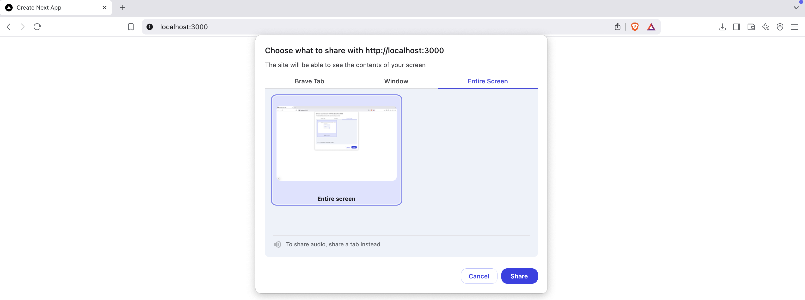
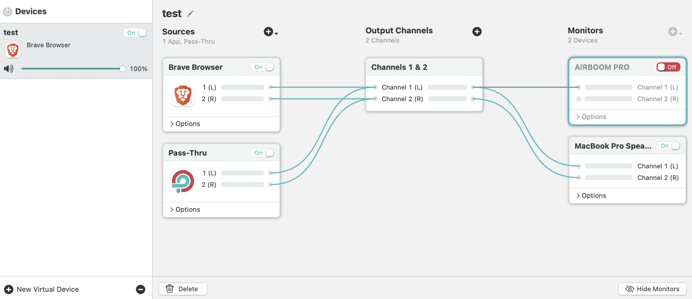

# 🎥 ScreenSage



A modern, web-based screen recording application built with Next.js and TypeScript. This application allows users to record their screen with system audio support and provides a clean, intuitive interface for recording, pausing, and downloading screen captures.

[Sample result](assets/image/sample-recording.webm)

## Project Background

This project was created as a fun project to facilitate the creation of tutorial videos for team training and documentation purposes. The need for a simple, yet effective screen recording tool that could capture both screen content and system audio led to the development of this application.

## Features

- 🎥 Screen recording with system audio capture
- 🎤 Automatic fallback to microphone if system audio is unavailable
- 🔊 Support for Loopback audio device for high-quality system sound capture
- ⏯️ Pause and resume recording functionality
- 💾 Download recordings in WebM format
- 🎨 Modern UI built with Tailwind CSS
- 🔍 Loopback audio device detection for better audio quality

## Audio Setup

Due to web browsers' security and privacy restrictions, the `getDisplayMedia()` API (used for screen recording) cannot directly capture system audio. To work around this limitation, we use [Loopback](https://rogueamoeba.com/loopback/) to create a virtual audio device that can capture and route system audio to our application.

For the best audio quality when recording system sound:

1. Install [Loopback](https://rogueamoeba.com/loopback/) (macOS) to create a virtual audio device
2. Set up a virtual device in Loopback to capture system audio
3. The application will automatically detect the Loopback device and use it for recording

Here's an example of a simple Loopback setup with a virtual device:



This ensures high-quality system audio capture without the need for additional configuration.

## Tech Stack

- Next.js 15.1
- React 19
- TypeScript
- Tailwind CSS
- Lucide React (for icons)
- Radix UI (for UI components)

## Getting Started

### Prerequisites

- Node.js (Latest LTS version recommended)
- npm or yarn

### Installation

1. Clone the repository:
```bash
git clone https://github.com/carakawedhatama/screensage.git
cd screensage
```

2. Install dependencies:
```bash
npm install
# or
yarn install
```

3. Start the development server:
```bash
npm run dev
# or
yarn dev
```

4. Open [http://localhost:3000](http://localhost:3000) in your browser to see the application.

## Usage

1. Click the "Start Recording" button to begin
2. Select the screen/window you want to record
3. Choose your audio input source when prompted
4. Use the pause/resume button to control the recording
5. Click "Stop Recording" when finished
6. Download your recording using the download button

## Browser Compatibility

This application works best in modern browsers that support the `MediaRecorder` API and screen capture capabilities. For the best experience, use the latest versions of:

- Google Chrome
- Microsoft Edge
- Firefox
- Brave

Currently Safari browser doesn't support `MediaRecorder` API and screen capture.

## License

This project is open source and available under the MIT License.

## Contributing

Contributions are welcome! Please feel free to submit a Pull Request.
